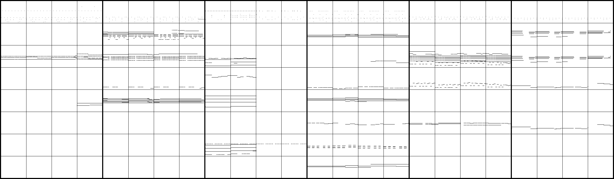

# Data

## Lakh Pianoroll Dataset

We use the _cleansed_ version of
[Lakh Pianoroll Dataset](https://salu133445.github.io/lakh-pianoroll-dataset/)
(LPD). LPD contains 174,154 unique
[multitrack pianorolls](https://salu133445.github.io/musegan/representation)
derived from the MIDI files in the
[Lakh MIDI Dataset](http://colinraffel.com/projects/lmd/) (LMD),
while the cleansed version contains 21,425 pianorolls that
are in 4/4 time and have been matched to distinct entries in
[Million Song Dataset](https://labrosa.ee.columbia.edu/millionsong/) (MSD).

## Training Data

- Use _symbolic timing_, which discards tempo information
  (see [here](https://salu133445.github.io/lakh-pianoroll-dataset/representation) for more
  details)
- Discard velocity information (using binary-valued pianorolls)
- 84 possibilities for note pitch (from C1 to B7)
- Merge tracks into 8 categories: _Drums_, _Piano_, _Guitar_, _Bass_,
  _Ensemble_, _Reed_, _Synth Lead_ and _Synth Pad_
- Consider only songs with an _alternative_ tag
- Randomly pick 6 phrases of 4-bar long from each song

Hence, the size of the target output tensor is 4 (bar) &times; 96 (time step)
&times; 84 (pitch) &times; 8 (track).

- [lastfm_alternative_8b_phrase.npy](https://drive.google.com/uc?export=download&id=1f9NKbhIxIbedHR370sc_hF9730985Xre)
  (3.38 GB) contains 13,746 four-bar phrases from 2,291 songs with _alternative_
  tags. The shape is (2291, 6, 4, 96, 84, 8).

The following are six sample pianoroll seen in our training data, where each
block represents a bar. The tracks are (from top to bottom): _Drums_, _Piano_,
_Guitar_, _Bass_, _Ensemble_, _Reed_, _Synth Lead_ and _Synth Pad_

