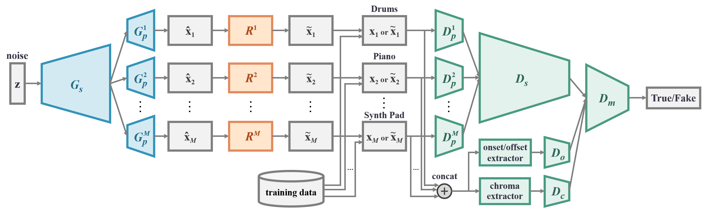
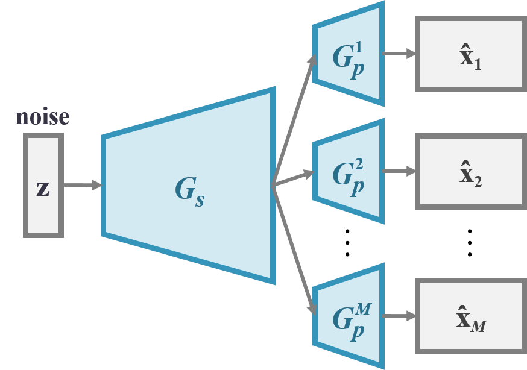
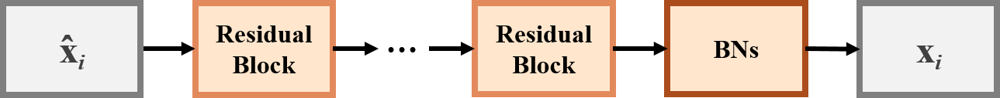
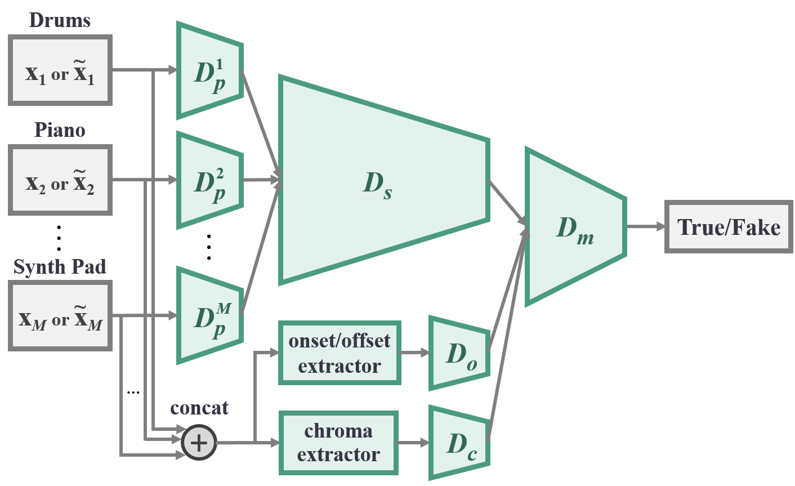

# Model

The design is based on [MuseGAN](https://salu133445.github.io/musegan/) [1] as differences summarized below:

- Instead of using multiple generators and use shared/private input vectors to
  handle the multi-track interdependency, we proposed to use shared/private
  generators.
- Instead of using one single discriminator, we proposed to introduce
  shared/private design to the discriminator.
- To help the discriminator extract musically-relevant features, we proposed to
  add to the discriminator an *onset/offset stream* and a *chroma stream*.

## Generator

The generator *G* consists of a shared network <i>Gs</i> followed by
*M* private network <i>Gpi</i> (*i* = 1 &hellip; *M*), one
for each track. The *shared* network is responsible for producing a high-level
representation of the output musical segments that is shared by all the tracks.
Each *private* network then turns such abstraction into the final piano-roll
output for the corresponding track.

> This design reflects the intuition that different tracks have their own
musical properties (e.g., textures, common-used patterns, playing techniques),
while jointly they follow a common, high-level musical idea.

## Refiner

The refiner *R* is composed of *M* private networks <i>Ri</i>, (*i* =
1 &hellip; *M*), one for each track. The refiner aims to refine the real-valued
outputs of the generator into binary ones rather than learning a new mapping
from *G*(*z*) to the data space. Hence, we draw inspiration from *residual
learning* and propose to construct the refiner with a number of *residual
units*. The output layer of the refiner is made up of either DBNs or SBNs.

The refiner network. (<i>The tensor size remains the same throughout the network.</i>)

Residual unit used in the refiner network. (<i>The values denote the kernel size and the number of the output channels.</i>)

## Discriminator

Similar to the generator, the discriminator *D* consists of *M* private network
<i>Dpi</i> (*i* = 1 &hellip; *M*), one for each track,
followed by a shared network <i>Ds</i>. Each private network first
extracts low-level features from the corresponding track of the input
piano-roll. Their outputs are then concatenated and sent to the shared network
to extract higher-level abstraction shared by all the tracks.

In the *onset/offset stream*, the differences between adjacent elements in the
piano-roll along the time axis are first computed, and then the resulting matrix
is summed along the pitch axis, which is finally fed to <i>Do</i>.

In the *chroma stream*, the piano-roll is viewed as a sequence of one-beat-long
frames. A chroma vector is then computed for each frame and jointly form a
matrix, which is then be fed to <i>Dc</i>.

> Note that all the operations involved in computing the chroma and onset/offset
features are differentiable, and thereby we can still train the whole network by
back propagation.

Finally, the intra-bar features extracted from the three streams are fed to
<i>Dm</i> to extract inter-bar features and to make the final
prediction.

## Reference

1. Hao-Wen Dong, Wen-Yi Hsiao, Li-Chia Yang and Yi-Hsuan Yang,
   "MuseGAN: Multi-track Sequential Generative Adversarial Networks for Symbolic
   Music Generation and Accompaniment,"
   in *AAAI Conference on Artificial Intelligence* (AAAI), 2018.
