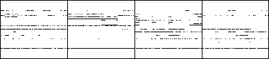
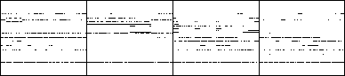
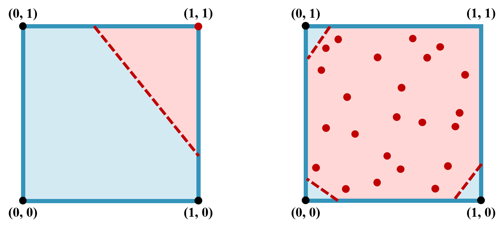

# Motivations

Conventional CNN designs can only generate real-valued predictions and require
further postprocessing (e.g., hard thresholding or Bernoulli sampling) at test
time to obtain the final binary-valued piano-rolls. This raises the following
two issues.

## Over-fragmented Notes Generated using Naïve Binarization Strategies

Naïve methods for binarizing a piano-roll at test time can easily lead to
*overly-fragmented notes*.

- For hard thresholding, the generated real-valued piano-roll has many entries
  with values close to the threshold.
- For Bernoulli sampling, it is possible to fire a note even for an entry with
  low probability due to the stochastic nature.

| Strategy | Result |
|:--------:|:------:|
| raw prediction of   the pretrained G ||
| Bernoulli sampling (at test time) |  |
| Hard thresholding (at test time) |  |

## Difficulties in Training the Discriminator and the Generator

The real-valued predictions generated by the generator *G* in GAN may lead to
difficulties in training the discriminator counterpart *D*. The following figure
illustrates the decision boundaries (red dashed lines) that *D* has to learn in
different scenarios. The decision boundaries divide the space into the *real*
class (in *blue*) and the *fake* class (in *red*). The black and red dots
represent the real data and the fake ones generated by *G*, respectively. We can
see that the decision boundaries are easier to learn when *G* outputs binary
values (*left*) rather than real values (*right*).

Moreover, after passing through the first few convolutional layers of *D*, a
real-valued piano-roll generated by the *G* may look similar to a binary-valued
piano-roll sampled from real data. As a result, *G* does not need to “learn
hard” to generate realistic results (e.g. binary-valued ones) for it already has
a shortcut to create the so-called *adversarial examples* to fool *D*.
