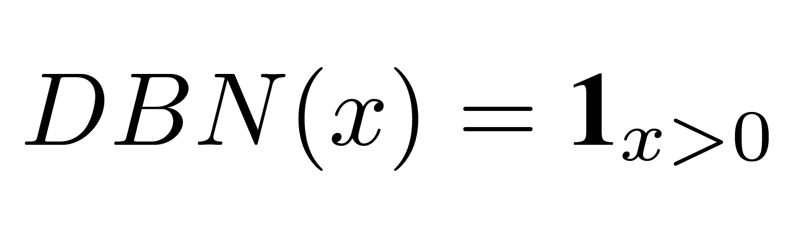
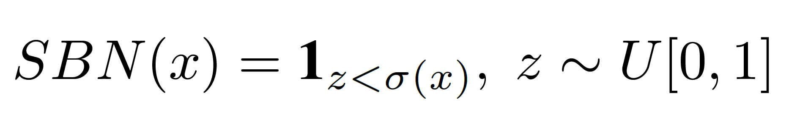

# Binary Neurons

## Stochastic and Deterministic Binary Neurons

*Binary neurons* (BNs) are neurons that output binary-valued predictions. In
this work, we consider two types of BNs:

- *Deterministic Binary Neurons* (DBNs) act like neurons with hard thresholding
  functions as their activation functions. We define the output of a DBN for a
  real-valued input *x* as:
  
  where **1**(&middot;) is the indicator function.

- *Stochastic Binary Neurons* (SBNs) binarize a real-valued input *x* according
  to a probability, defined as:
  
  where &sigma;(&middot;) is the logistic sigmoid function and *U*[0, 1] denotes
  an uniform distribution.

## Straight-through Estimator

Computing the exact gradients for either DBNs or SBNs, however, is intractable,
for doing so requires the computation of the average loss over all possible
binary samplings of all the BNs, which is exponential in the total number of
BNs.

A few solutions have been proposed to address this issue [1, 2]. In this work,
we resort to the sigmoid-adjusted *straight-through* (ST) estimator when
training networks with DBNs and SBNs. The ST estimator is first proposed in [3],
which simply treats BNs as identify functions and ignores their gradients. The
sigmoid-adjusted ST estimator is a variant which multiply the gradients in the
backward pass by the derivative of the sigmoid function.

By replacing the non-differentiable functions, which are used in the forward
pass, by differentiable functions (usually called the *estimators*) in the
backward pass, we can then train the whole network with back propagation.

## References

1. Binary Stochastic Neurons in Tensorflow, 2016.
   Blog post on R2RT blog.
   [[link](https://r2rt.com/binary-stochastic-neurons-in-tensorflow.html)]

2. Yoshua Bengio, Nicholas Léonard and Aaron C. Courville,
   "Estimating or propagating gradients through stochastic neurons for
   conditional computation," *arXiv preprint arXiv:1308.3432*, 2013.

3. Geoffrey Hinton,
   "Neural networks for machine learning - using noise as a regularizer (lecture
   9c)", 2012.
   Coursera, video lectures.
   [[link](https://www.youtube.com/watch?v=LN0xtUuJsEI)]
