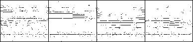
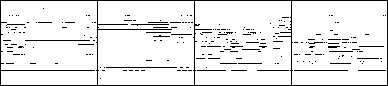
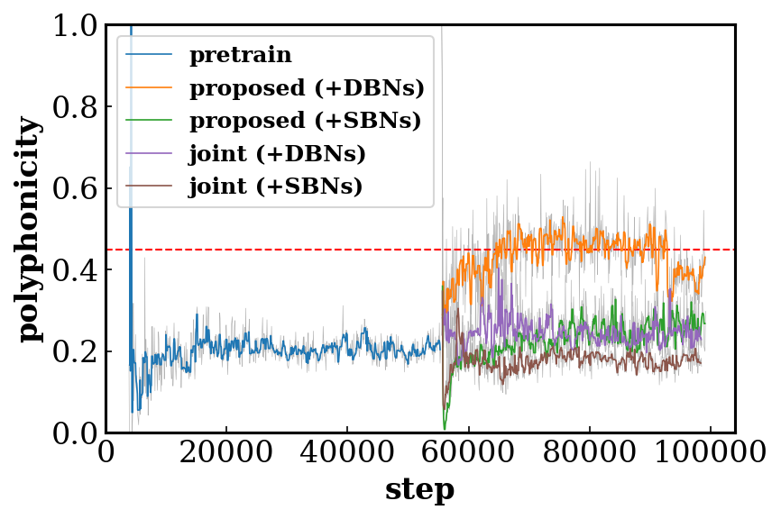
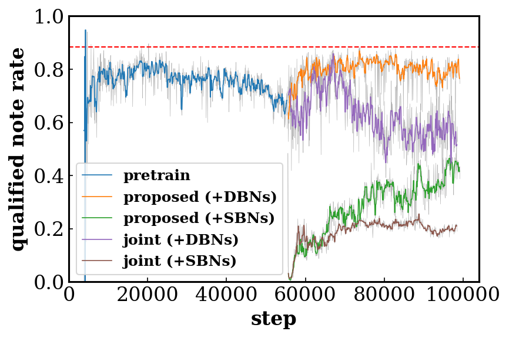
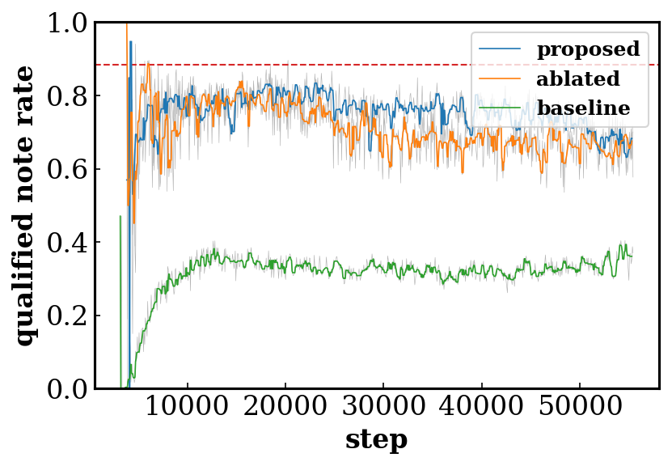

# Results

## Qualitative Results

> Note that only the guitar track is shown.

| Strategy                                | Result                                                                                                      |
|:---------------------------------------:|:-----------------------------------------------------------------------------------------------------------:|
| raw prediction of the pretrained _G_ |                                  |
| Bernoulli sampling (at test time)    |  |
| hard thresholding (at test time)     |          |
| proposed model with SBNs             |                      |
| proposed model with DBNs             |                              |

## Quantitative Results

### Evaluation metrics

- __Qualified note rate__ (QN) computes the ratio of the number of the qualified
  notes (notes no shorter than three time steps, i.e., a 32th note) to the total
  number of notes. Low QN implies overly fragmented music.
- __Polyphonicity__ (PP) is defined as the ratio of the number of time steps
  where more than two pitches are played to the total number of time steps.
- __Tonal distance__ (TD) measures the distance between the chroma features (one
  for each beat) of a pair of tracks in the tonal space proposed in [1].

### Comparisons of training and binarization strategies

### Effects of the shared/private and multi-stream design of the discriminator

## Audio Samples

The audio samples presented below are in a high temporal resolution of 24 time
steps per beat. Hence, they are not directly comparable to the results presented
on the MuseGAN [website](https://salu133445.github.io/musegan/results).

> No cherry-picking. Some might sound unpleasant. __Lower the volume first!__

| Model                             | Result                                                             |
|:---------------------------------:|:------------------------------------------------------------------:|
| hard thresholding (at test time)  |      |
| Bernoulli sampling (at test time) |  |
| proposed model (+SBNs)            |   |
| proposed model (+DBNs)            |       |
| end-to-end model (+SBNs)          |    |
| end-to-end model (+DBNs)          |        |

## Reference

1. Christopher Harte, Mark Sandler, and Martin Gasser,
   "Detecting Harmonic Change In Musical Audio,"
   in _Proc. ACM MM Workshop on Audio and Music Computing Multimedia_, 2006.
